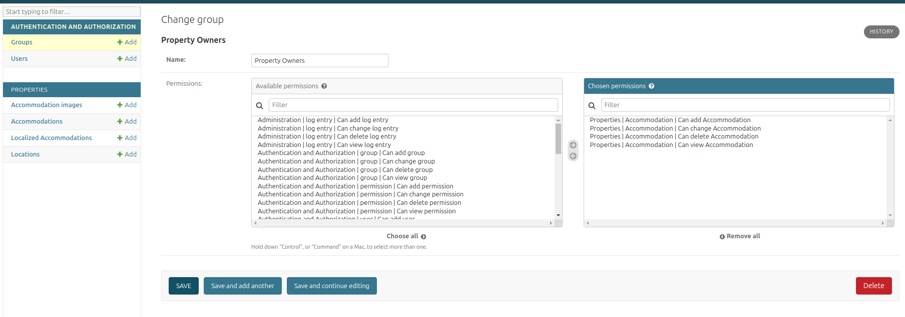

# Inventory Management System
An efficient and scalable inventory management system built with Django. It supports features like property management, user authentication, and geospatial data integration.


## Table of Contents
1. [Project Overview](#project-overview)
2. [Features](#features)
3. [Tech Stack](#tech-stack)
4. [Set up this project](#installation)
   - [Clone the repository](#clone-the-repository)
   - [Install dependencies](#install-dependencies)
   - [Set up environment variables](#set-up-environment-variables)
   - [Database setup](#database-setup)
5. [Running the Project](#running-the-project)
   - [Run Server](#run-server)
   - [Run Tests](#run-tests)
   - [Sitemap Generator](#sitemap-generate)

7. [Contributing](#contributing)
8. [Connect with Me](#connect-with-me)


## Django project structure
```
Django-Docker/
├── inventory-management/
│   ├── env/                     # Virtual environment directory 
│   ├── mysite/    # Main Django application
│   │   ├── __init__.py
│   │   ├── asgi.py              # ASGI entry point for deployment
│   │   ├── settings.py          # Main project settings
│   │   ├── urls.py              # Main project URLs
│   │   ├── wsgi.py              # WSGI entry point for deployment
│   │   └── __pycache__/         # Python cache files (ignored by version control)
│   ├── properties/              # Core app for the inventory system
│   │   ├── __init__.py
│   │   ├── admin.py             # Admin configurations
│   │   ├── apps.py              # App-specific settings
│   │   ├── forms.py             # Custom Django forms
│   │   ├── models.py            # Django models
│   │   ├── tests.py             # Test cases for the app
│   │   ├── urls.py              # URLs specific to the app
│   │   ├── views.py             # Views for handling HTTP requests
│   │   ├── migrations/          # Database migrations
│   │   │   ├── __init__.py
│   │   │   └── ...              # Migration files
│   │   ├── templates/           # HTML templates
│   │   │   ├── base.html
│   │   │   ├── signup.html
│   │   │   └── ...
│   │   └── csv/                 # contain csv file
│   │       
│   │       
│   │       
│   ├── manage.py                # Django’s command-line utility
│   ├── requirements.txt         # Python dependencies
│   ├── pytest.ini               # Pytest configuration
│   ├── Dockerfile               # Dockerfile for building the app
│   ├── docker-compose.yml       # Docker Compose file
│   ├── .env                     # Environment variables
│   ├── README.md                # Project documentation
│   ├── .gitignore               # Ignored files for Git
│                
└── postgres-data/               # Data volume for PostgreSQL container
```


## Project Overview
This project is designed to streamline the management of properties, users, and locations with features such as geospatial data integration, advanced user permissions, and import/export capabilities for data. Built with Django, it supports efficient workflows for property owners and admins.

## Features
- User Authentication and Role Management
- Geospatial Data Handling (Django GIS)
- Import/Export Data via Admin Panel
- Amenity Validation for JSON Fields
- Unit and Integration Testing with Pytest

## Tech Stack

- **Backend**: Django
- **Database**: PostgreSQL with PostGIS
- **Testing**: `pytest`, `pytest-django`, `pytest-cov`
- **Geospatial**: Leaflet
- **Containerization**: Docker

## Set up this project
#### 1. Clone the repository from GitHub
Clone the project repository from GitHub to local machine
```
https://github.com/siam29/Django-Docker.git
```
#### 2. Navigate to the ```inventory-management``` directory
Change the current directory to inventory-management inside the cloned repository
```
cd inventory-management/
```
#### 3. Create a Python virtual environment
reate a new Python virtual environment in the project directory to isolate dependencies
```
python3 -m venv env
```
#### 4. Activate the virtual environment
```
source env/bin/activate
```
#### 5. Install required dependencies
Install all the required dependencies listed in ```requirements.txt```

```
pip install -r requirements.txt
```
#### 6. Build the Docker container
Build the Docker container for your project
```
docker-compose build
```
```Hint:``` This command sets up the Docker containers as specified in your docker-compose.yml file, creating the environment for your Django project.
#### 7. Up the Docker container
Bring up the Docker containers and start the services
```
docker-compose up
```

#### 8. Check the running containers
```
docker ps
```
```Hint:``` This will show you the currently running containers and their status.


#### 9. Make Migrations
To apply database changes, run the following command to create migration files:
```
docker exec -it inventoryManagement python manage.py makemigrations
```
#### 10. Apply Migrations
Apply the migrations to update the database schema:
```
docker exec -it inventoryManagement python manage.py migrate
```

#### 11. Check the Status of Migrations
To check which migrations have been applied:
```
docker exec -it inventoryManagement python manage.py showmigrations
```
#### 12. Create superuser
To access the Django admin panel, need to create a superuser. Run the following command to enter the Docker container and create the superuser:
```
docker exec -it inventoryManagement python manage.py createsuperuser
```
Then show this messege. Fill up this carefully and remember the password 

- Username (leave blank to use 'root'): <Enter user name>
- Email address: 
- Password: 
- Password (again): 
- The password is too similar to the username.
- This password is too common.
- Bypass password validation and create user anyway? [y/N]: y
- Superuser created successfully.

After completing these steps, you will have a superuser created for your Django application. You can log into the Django admin panel by going to:
## Run this project

Paste this url for the admin before create the superuser username and password now enter this for sign in admin.
```
http://localhost:8000/admin/
```
Once logged in as an ```admin```, you can mark other users as ```Active```, ```Staff```, or ```Superuser```. This allows you to manage user roles and permissions, enabling them to log in and add accommodations.

### Property Owners Creation
click on ```Groups``` table and create a ```Property Owners``` group and gave this four permission showing in the image below and click the save button.

Go to the url and paste this command for registration a user
```
http://localhost:8000/signup/
```
### Test this project
To run tests with coverage, use ```pytest```
```
docker exec -it inventoryManagement pytest --cov=properties --cov-report=term-missing
```

### Sitemap Generate
Generating a sitemap helps search engines to better understand the structure of this website. With the following command, we can generate a sitemap for the Django application.
```
docker-compose exec web python manage.py generate_sitemap
```
## Contributing
Contributions are welcome! Please fork the repository and submit a pull request for any bug fixes or feature requests.

## Connect with Me
If you have any questions, suggestions, or feedback, feel free to reach out to me through the following channels
- Email: almahmudsiam15@gmail.com
- GitHub: https://github.com/siam29
